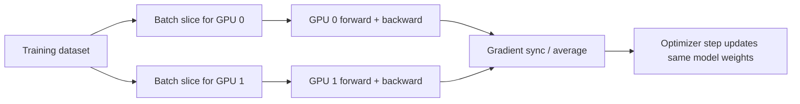
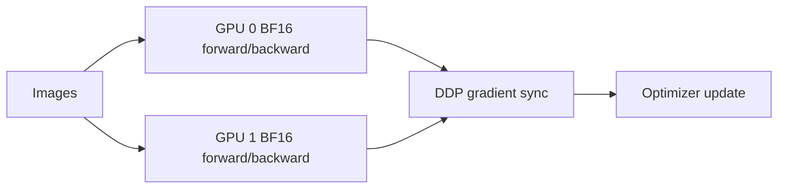

# Gradient Accumulation and Multi-GPU Training

## What Gradient Accumulation Means

Gradient accumulation lets you train with a larger effective batch size without putting the entire batch into GPU memory at once.

Instead of updating the model after every mini-batch, the trainer can:

1. Run a forward pass.
2. Compute loss.
3. Compute gradients.
4. Keep those gradients.
5. Repeat for a few mini-batches.
6. Update the model once.

In this project, it is controlled by:

```bash
--gradient-accumulation-steps 1
```

or in `.env`:

```bash
GRADIENT_ACCUMULATION_STEPS=1
```

If the value is `1`, the model updates after every batch.

If the value is `4`, the model waits for 4 mini-batches before updating.

## Effective Batch Size

In this project:

```text
effective batch size =
batch size per GPU * number of GPUs * gradient accumulation steps
```

Example with 2 GPUs:

```text
BATCH_SIZE=128
NUM_PROCESSES=2
GRADIENT_ACCUMULATION_STEPS=1

effective batch size = 128 * 2 * 1 = 256
```

Example with 2 GPUs and accumulation:

```text
BATCH_SIZE=64
NUM_PROCESSES=2
GRADIENT_ACCUMULATION_STEPS=4

effective batch size = 64 * 2 * 4 = 512
```

This is useful when `BATCH_SIZE=256` does not fit in GPU memory, but `BATCH_SIZE=64` does.

## How It Works With 2 GPUs

With DDP, each GPU gets a different slice of data.



Both GPUs have their own copy of the model. Each GPU trains on different images. After backward pass, DDP synchronizes gradients so both model copies receive the same update.

That is why 2 GPUs can train faster: two batches are processed at the same time.

## How It Works With Gradient Accumulation

Example:

```text
BATCH_SIZE=64
NUM_PROCESSES=2
GRADIENT_ACCUMULATION_STEPS=2
```

```mermaid
sequenceDiagram
    participant GPU0
    participant GPU1
    participant DDP
    participant OPT as Optimizer

    GPU0->>GPU0: Mini-batch 1, compute gradients
    GPU1->>GPU1: Mini-batch 1, compute gradients
    GPU0->>GPU0: Mini-batch 2, add gradients
    GPU1->>GPU1: Mini-batch 2, add gradients
    GPU0->>DDP: Sync accumulated gradients
    GPU1->>DDP: Sync accumulated gradients
    DDP->>OPT: One optimizer step
```

The model update sees:

```text
64 images on GPU 0
64 images on GPU 1
for 2 accumulation steps

64 * 2 * 2 = 256 images before one optimizer update
```

## When To Increase Gradient Accumulation

Increase `GRADIENT_ACCUMULATION_STEPS` when:

- You want a larger effective batch size.
- Your GPU runs out of memory with a bigger `BATCH_SIZE`.
- You want to reproduce a training recipe that uses a large global batch.

Example:

```bash
BATCH_SIZE=64
GRADIENT_ACCUMULATION_STEPS=4
```

This uses less memory than:

```bash
BATCH_SIZE=256
GRADIENT_ACCUMULATION_STEPS=1
```

but can behave similarly from the optimizer's point of view.

## Practical Starting Point For 2 GPUs

For your 2 GPU RunPod:

```bash
NUM_PROCESSES=2
BATCH_SIZE=128
GRADIENT_ACCUMULATION_STEPS=1
```

If memory is too high:

```bash
BATCH_SIZE=64
GRADIENT_ACCUMULATION_STEPS=2
```

Both give:

```text
effective batch size = 256
```

The second option uses less memory per GPU, but each optimizer update takes more mini-batches.

## Mixed Precision

Mixed precision means the training job uses smaller number formats for some operations instead of using full 32-bit floating point precision everywhere.

In this project, it is controlled by:

```bash
--mixed-precision bf16
```

or in `.env`:

```bash
MIXED_PRECISION=bf16
```

The common options are:

```text
no    = use full FP32 precision
fp16  = use 16-bit floating point
bf16  = use bfloat16
```

## Why Mixed Precision Helps

Mixed precision can:

- Use less GPU memory.
- Make training faster.
- Allow a larger `BATCH_SIZE`.
- Improve throughput on modern GPUs.

Simple example:

```text
FP32:
  more memory
  very stable
  usually slower

BF16:
  less memory
  fast on modern GPUs
  usually stable

FP16:
  less memory
  fast
  can be less stable than BF16
```

## BF16 vs FP16

For most modern NVIDIA GPUs, `bf16` is the best first choice.

Use:

```bash
MIXED_PRECISION=bf16
```

BF16 has a wider numeric range than FP16, so it is usually more stable. That means fewer problems with exploding or underflowing gradients.

Use `fp16` when:

- Your GPU does not support BF16.
- You are following an older training recipe that expects FP16.

Use `no` when:

- You are debugging.
- You see strange loss values.
- You want the most conservative training mode.

## Mixed Precision With 2 GPUs

Mixed precision and multi-GPU training work together.



Each GPU uses mixed precision for the model operations, and DDP still synchronizes gradients across GPUs.

## Practical Recommendation

For your 2 GPU RunPod, start with:

```bash
NUM_PROCESSES=2
BATCH_SIZE=128
GRADIENT_ACCUMULATION_STEPS=1
MIXED_PRECISION=bf16
```

If training crashes with an out-of-memory error:

```bash
BATCH_SIZE=64
GRADIENT_ACCUMULATION_STEPS=2
MIXED_PRECISION=bf16
```

If training produces `nan` loss or unstable metrics:

```bash
MIXED_PRECISION=no
```

Then try again. If FP32 works but BF16 does not, lower the learning rate or batch size before switching back.

## Other Useful Memory Settings

If GPU memory is tight, change settings in this order:

1. Lower `BATCH_SIZE`.
2. Increase `GRADIENT_ACCUMULATION_STEPS` to keep the same effective batch size.
3. Use `MIXED_PRECISION=bf16`.
4. Lower `IMG_SIZE` for experiments.
5. Use fewer DataLoader workers if CPU RAM is the problem.

Example:

```text
Original:
BATCH_SIZE=128
GRADIENT_ACCUMULATION_STEPS=1
Effective batch size with 2 GPUs = 256

Lower memory:
BATCH_SIZE=64
GRADIENT_ACCUMULATION_STEPS=2
Effective batch size with 2 GPUs = 256
```
