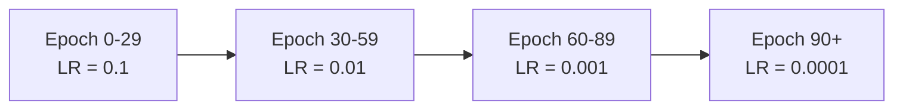

# Training Concepts

## Weight Decay

Weight decay is a regularization technique that gently pushes model weights toward smaller values during training.

In this project, it is controlled by:

```bash
--weight-decay 1e-4
```

or in `.env`:

```bash
WEIGHT_DECAY=1e-4
```

The optimizer is SGD, so weight decay adds a small penalty to large weights on every optimizer step. This can help the model generalize better instead of memorizing the training images too closely.

Simple intuition:

```text
No weight decay:
The model can make weights very large if that helps fit the training data.

With weight decay:
The model is slightly punished for large weights, so it learns simpler patterns.
```

For ResNet-50/ImageNet-style training, a common starting value is:

```bash
1e-4
```

That means `0.0001`.

## Bias and Normalization Weight Decay

This project separates parameters into two groups:

```text
weight decay:
  normal convolution and linear weights

no weight decay:
  bias parameters
  batch norm / normalization parameters
```

That behavior is controlled by:

```bash
--bias-weight-decay
--norm-weight-decay
```

By default, both are disabled, meaning bias and normalization parameters do **not** receive weight decay.

This is common in modern image training because applying weight decay to bias and normalization parameters can sometimes hurt accuracy or make training less stable. The main model weights still receive weight decay.

## Where It Is Implemented

The logic lives in:

```text
src/ddp_vision/optim.py
```

The key function is:

```python
build_optimizer(...)
```

It creates separate optimizer parameter groups for decay and no-decay parameters.

## Learning Rate

Learning rate controls how big each optimizer update is.

In this project:

```bash
--learning-rate 0.1
```

or in `.env`:

```bash
LEARNING_RATE=0.1
```

Simple intuition:

```text
learning rate too low:
  training is slow

learning rate too high:
  loss may jump around or become nan

learning rate just right:
  loss usually goes down smoothly
```

For ResNet-50 with SGD, `0.1` is a common ImageNet-style starting point when the effective batch size is around `256`.

If you change the effective batch size a lot, you may also need to change learning rate.

## Learning Rate Scheduler

The learning rate does not have to stay the same for the whole training run.

A learning rate scheduler changes the learning rate over time.

This project uses `StepLR` by default:

```bash
--lr-step-size 30
--step-lr-decay 0.1
```

or in `.env`:

```bash
LR_STEP_SIZE=30
STEP_LR_DECAY=0.1
```

That means:

```text
Start learning rate: 0.1
After 30 epochs:     0.01
After 60 epochs:     0.001
After 90 epochs:     0.0001
```

Small diagram:



Why do this?

Early in training, a larger learning rate helps the model learn quickly. Later in training, a smaller learning rate helps it fine-tune weights more carefully.

## Learning Rate Warmup

Warmup starts training with a smaller learning rate, then gradually increases to the target learning rate.

In this project:

```bash
--lr-warmup-epochs 5
--lr-warmup-start-factor 0.1
```

or in `.env`:

```bash
LR_WARMUP_EPOCHS=5
```

Example:

```text
target learning rate = 0.1
warmup start factor  = 0.1
starting LR          = 0.1 * 0.1 = 0.01
```

Warmup is useful for:

- Large batch training.
- Multi-GPU training.
- Avoiding unstable early updates.

For demo training, `LR_WARMUP_EPOCHS=0` is fine. For ImageNet-style training, `5` is a reasonable starting value.

## Momentum

Momentum helps SGD keep moving in a useful direction instead of reacting only to the current mini-batch.

In this project:

```bash
--momentum 0.9
```

or in `.env`:

```bash
MOMENTUM=0.9
```

Simple intuition:

```text
without momentum:
  each update depends mostly on the current batch

with momentum:
  updates remember previous direction
```

`0.9` is a common default for ResNet-style image training.

## Gradient Clipping

Gradient clipping prevents gradients from becoming too large.

In this project:

```bash
--max-grad-norm 1.0
```

or in `.env`:

```bash
MAX_GRAD_NORM=1.0
```

If gradients are bigger than this limit, they are scaled down before the optimizer step.

This can help avoid unstable training, especially with mixed precision or high learning rates.

## Epochs

One epoch means the training loop has seen the full training dataset once.

In this project:

```bash
--epochs 10
```

or in `.env`:

```bash
EPOCHS=10
```

For quick learning runs, use a small number like `2` or `10`.

For ImageNet-style ResNet-50 training, `90` epochs is a classic baseline.

## Checkpoint Interval

Checkpoints save training state so you can resume later.

In this project:

```bash
--save-checkpoint-interval 10
```

or in `.env`:

```bash
SAVE_CHECKPOINT_INTERVAL=10
```

Checkpoints are saved under:

```text
runs/<experiment-name>/checkpoints/checkpoint_<epoch>
```

The checkpoint includes model state, optimizer state, scheduler state, and Accelerate distributed state.

Resume with:

```bash
--resume-from-checkpoint checkpoint_10
```

## Batch Size

In this project, `BATCH_SIZE` means batch size per GPU.

```bash
BATCH_SIZE=128
```

With 2 GPUs:

```text
effective batch size = 128 * 2 = 256
```

Gradient accumulation can increase this further. See:

```text
docs/gradient_accumulation.md
```

## Number of Workers

DataLoader workers load and preprocess images in the background.

In this project:

```bash
--num-workers 8
```

or in `.env`:

```bash
NUM_WORKERS=8
```

Higher values can improve throughput if the CPU and disk are fast enough.

Lower values can help if:

- The pod has limited CPU.
- The pod runs out of CPU RAM.
- Data loading becomes unstable.

Common starting values:

```text
small pod: 4
normal GPU pod: 8
large CPU/GPU pod: 16 or 24
```

## Image Size

Image size controls the input resolution.

In this project:

```bash
--img-size 224
```

or in `.env`:

```bash
IMG_SIZE=224
```

For ResNet-50, `224` is the standard ImageNet input size.

Lower image size uses less memory and runs faster, but may reduce accuracy.

## Recommended Starting Settings

For a 2 GPU RunPod learning run:

```bash
NUM_PROCESSES=2
BATCH_SIZE=128
GRADIENT_ACCUMULATION_STEPS=1
LEARNING_RATE=0.1
WEIGHT_DECAY=1e-4
MOMENTUM=0.9
LR_STEP_SIZE=30
STEP_LR_DECAY=0.1
MIXED_PRECISION=bf16
NUM_WORKERS=8
```

If training is unstable:

```bash
LEARNING_RATE=0.01
MIXED_PRECISION=no
```

If GPU memory is too high:

```bash
BATCH_SIZE=64
GRADIENT_ACCUMULATION_STEPS=2
```
